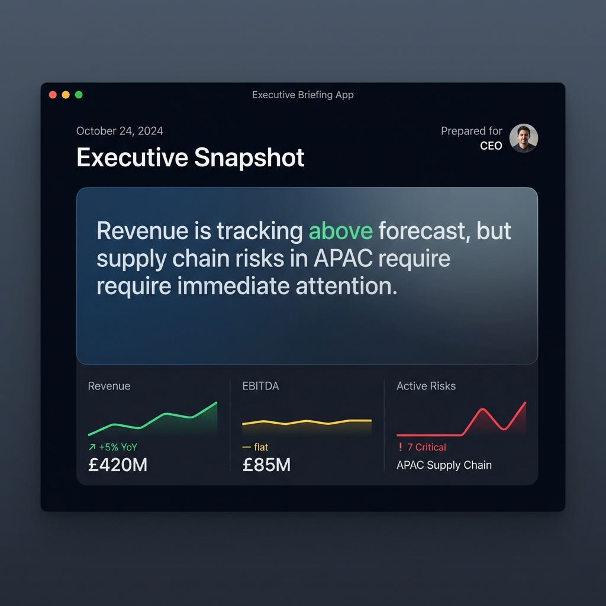
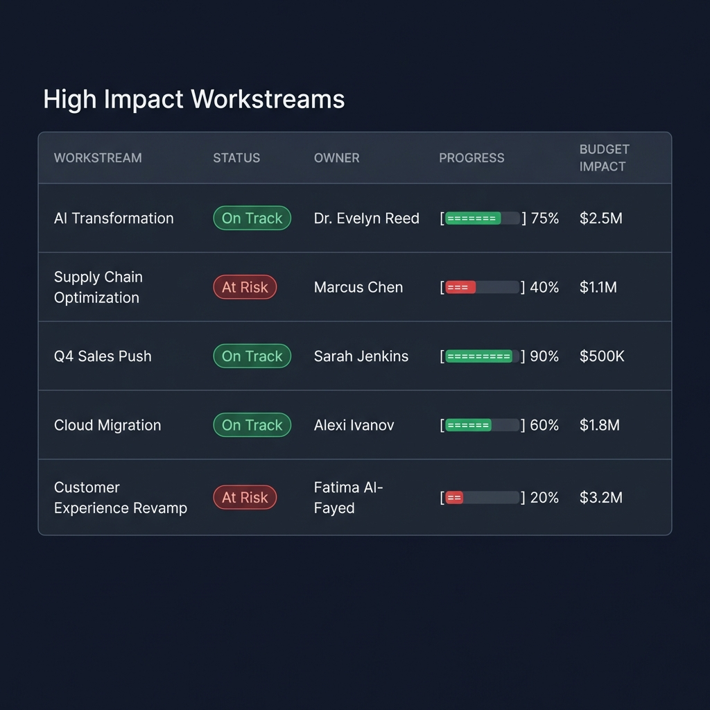
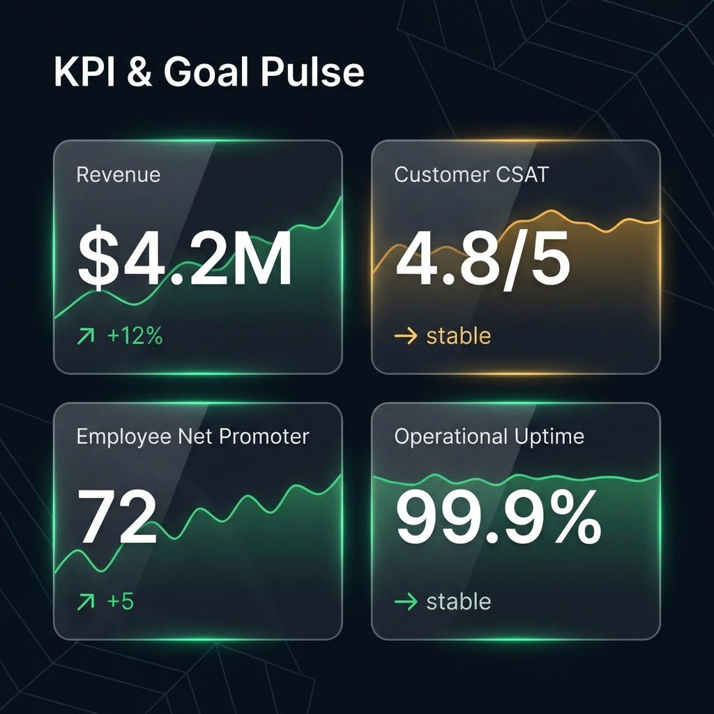

# Supervea Daily Business Review

**Supervea Daily Business Review** is an end-to-end executive briefing system designed to provide leadership with a real-time, consolidated view of critical business metrics, workstreams, and risks. 

It features a high-performance **FastAPI** backend for deterministic data handling and a modern **Next.js** frontend for a premium user experience.

---

## 📸 Snapshot Gallery

### 1. Executive Snapshot
The landing view provides an immediate, high-level summary of the business health.


### 2. High Impact Workstreams
Detailed tracking of strategic initiatives, budget impact, and risk status.


### 3. KPI & Goal Pulse
Real-time monitoring of critical KPIs with trend analysis and status indicators.


---

## 🏗️ Architecture

The system follows a modern client-server architecture:

### Backend (Python/FastAPI)
- **Framework**: FastAPI (Async, Type-safe)
- **Database**: SQLAlchemy 2.0 (Async) + SQLite (Dev) / PostgreSQL (Prod)
- **Validation**: Pydantic v2 for strict schema enforcement.
- **Key Features**:
    - **Atomic Briefings**: Each briefing is a self-contained, versioned record.
    - **Strict Typing**: Ensures data consistency across the entire pipeline.
    - **Scalable**: Ready for serverless deployment (Vercel/AWS Lambda).

### Frontend (TypeScript/Next.js)
- **Framework**: Next.js 16 (App Router)
- **Styling**: Tailwind CSS v4
- **State**: React Server Components for efficient data fetching.
- **Design**: Premium, dark-mode first UI with responsive layouts.

### Folder Structure
```
Supervea-Daily-Business-Review/
├── src/                # Backend Application Code
│   ├── api/            # API Endpoints (Routes)
│   ├── models.py       # database Tables (SQLAlchemy)
│   ├── schemas.py      # Pydantic Data Models
│   ├── main.py         # App Entry Point
│   └── database.py     # DB Connection Logic
├── frontend/           # Next.js Web Application
│   ├── app/            # Pages & Layouts
│   ├── components/     # UI Components (Snapshot, KPIs, etc.)
│   └── services/       # API Client Integration
├── docs/               # Documentation & Assets
└── requirements.txt    # Python Dependencies
```

---

## 🚀 Getting Started

### Prerequisites
- **Python 3.11+**
- **Node.js 18+**

### 1. Backend Setup
Initialize the API server to handle data requests.

```bash
# Install dependencies
pip install -r requirements.txt

# Start the server (runs on localhost:8000)
uvicorn src.main:app --reload
```
*API Docs available at: `http://localhost:8000/docs`*

### 2. Frontend Setup
Launch the web interface.

```bash
cd frontend

# Install Node modules
npm install

# Start the dev server (runs on localhost:3000)
npm run dev
```
*Access the app at: `http://localhost:3000`*

---

## ☁️ Deployment (Vercel)

This project is optimized for **Vercel** with a "Double Project" setup:

1.  **Frontend Project**: Deployed from strict `frontend/` root.
    *   Env: `NEXT_PUBLIC_API_URL` -> URL of Backend Project
2.  **Backend Project**: Deployed from repo root `.` (Auto-detected Python).
    *   Env: `DATABASE_URL` -> Postgres Connection String

*Configuration files included: `vercel.json`, `api/index.py`.*

---

## 🛡️ License
Private & Confidential.
