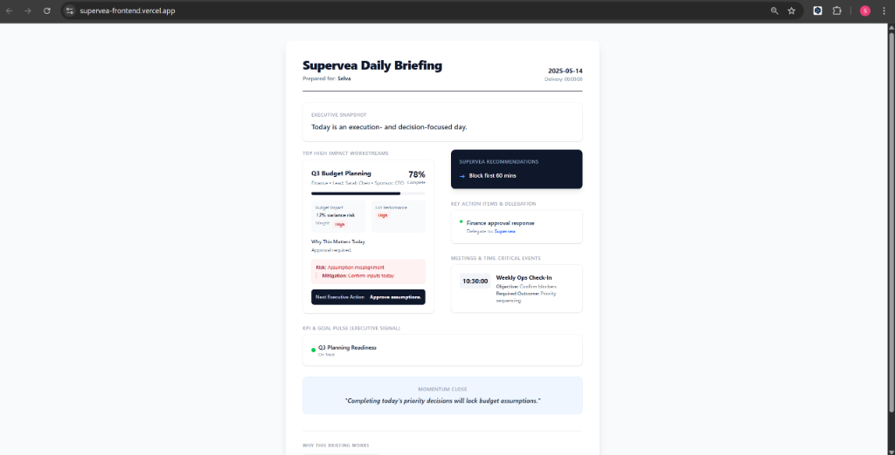
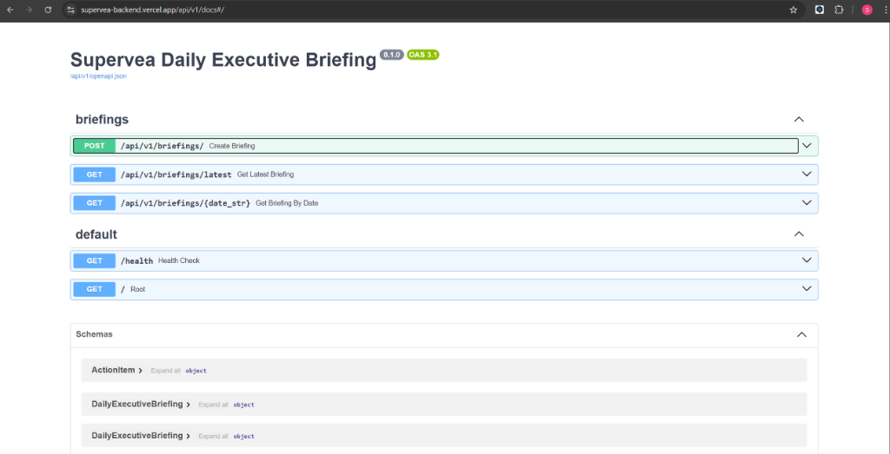

# Supervea Daily Business Review

**The ultimate minimalist executive briefing system.**

Designed to cut through the noise, Supervea delivers a high-impact, one-page daily digest for executives. It consolidates critical KPIs, workstream updates, and action items into a clean, distraction-free interface.

---

## 🚀 Live Demo

Experience the live application deployed on Vercel:

-   **Frontend Dashboard**: [https://supervea-daily-business-review.vercel.app](https://supervea-daily-business-review.vercel.app)
-   **Backend API Docs**: [https://supervea-backend.vercel.app/api/v1/docs](https://supervea-backend.vercel.app/api/v1/docs)

---

## 📸 Application Screenshots

### 1. The Executive Dashboard
A beautiful, responsive interface built with **Next.js** and **Tailwind CSS**. It features a "Momentum Close" section to ensure strategic alignment at the start of every day.



### 2. Interactive API Documentation
Powered by **FastAPI**, our backend provides automatic, interactive documentation (Swagger UI). This allows developers to test endpoints and manage database content directly from the browser.



---

## 🏗️ Technical Architecture

This project uses a modern, high-performance tech stack optimized for serverless deployment.

| Component | Technology | Description |
| :--- | :--- | :--- |
| **Frontend** | **Next.js 14** (App Router) | React framework for production. Server-side rendering ensures fast load times. |
| **Styling** | **Tailwind CSS** | Utility-first CSS framework for a bespoke, premium design language. |
| **Backend** | **FastAPI** | High-performance Python framework for building APIs with automatic validation. |
| **Database** | **Vercel Postgres (Neon)** | Serverless PostgreSQL database for persistent, scalable storage. |
| **ORM** | **SQLAlchemy + Pydantic** | Robust data modeling and schema validation. |
| **Deployment** | **Vercel** | Hosted using a "Double Project" strategy (Frontend + Python Backend). |

---

## ✨ Key Features

-   **Executive Snapshot**: A high-level summary of the day's strategic focus.
-   **High-Impact Workstreams**: Track progress, risks, and ownership of top-priority initiatives.
-   **KPI Pulse**: Real-time status indicators for critical business metrics.
-   **Smart Recommendations**: AI-ready structure for suggesting calendar blocks and focus areas.
-   **Mobile Responsive**: Perfectly readable on iPad, Mobile, and Desktop.

---

## 🛠️ Local Development Setup

If you want to run this project on your own machine:

### 1. Clone the Repository
```bash
git clone https://github.com/Selva201998/Supervea-Daily-Business-Review.git
cd Supervea-Daily-Business-Review
```

### 2. Backend Setup (Python)
```bash
# Create virtual environment
python -m venv venv
source venv/bin/activate  # On Windows: venv\Scripts\activate

# Install dependencies
pip install -r requirements.txt

# Run the server
uvicorn src.main:app --reload
```
*The backend will start at `http://localhost:8000`.*

### 3. Frontend Setup (Node.js)
```bash
cd frontend

# Install dependencies
npm install

# Run the development server
npm run dev
```
*Open [http://localhost:3000](http://localhost:3000) with your browser to see the result.*

---

## ☁️ Deployment Guide

This project is deployed on **Vercel** using two separate projects connected together:

1.  **Backend Project**: Deployed as a Python Serverless Function. Connected to **Vercel Storage (Postgres)** for data persistence.
2.  **Frontend Project**: Deployed as a Next.js Edge application. It connects to the backend via the `NEXT_PUBLIC_API_URL` environment variable.

For detailed deployment steps, please verify the [Deployment Guide](DOCUMENTATION.md).

---

**Developed by Selva**
